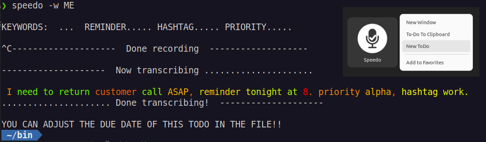

# Speak right into your todo.txt with `speedo`
---
## Record yout todo.txt tasks, set due dates, priority and tags directly from speech.


This zsh command line utility for Linux records a voice memo from the microphone or uses audio file(s) as the input and then ranscribes each input (using whisper.cpp, a C/C++ port of OpenAI's Whisper engine) into text, formated as to-do task in todo.txt or Confluence style (among others). 

The due date, context and priority fields in the todo.txt task can optionally be set with command line flags: 
```
speedo
speedo -c
speedo -w ME -p A
```
or extracted from the transcribed text, using user-configurable keywords. The format of the spoken task body could be something like:
```
"<FREE-FORM SPEECH> [$datekey <TIME REFERENCE>] [$hashkey|$priorkey <TAGS|PWORD>] 
```
For example, invoking `speedo -w ME`  and speaking:

>"I have to see my dentist next week. ***Reminder*** for Tuesday. ***hashtag*** health." or

> "Return customer call ASAP. ***Reminder*** tonight at 8. ***Priority*** Alpha. ***Hashtag*** work. "

will result in the following lines in todo.txt (or its equivalent):
```
.
.
() 2023-02-21  I have to see my dentist next week. Reminder for Tuesday. +health @ME due:2023-02-22
(A) 2023-02-21  Return customer call ASAP, reminder tonight at 8. +work @ME due:2023-02-21T20:00

```

For more info, invoking  `speedo  --help` will output:

```
             .~~~~~~~~~~~~~~~~~~~~~~~~~~~~~~~~~~~~~~~~~~~~~~~~~~~~~~~~~~~~~~~~~~~.
             |  speedo - Create a todotxt task and set tags, context, priority   |
             |    via speech. The Linux CLI power at the tip of your tongue!     |
             *~~~~~~~~~~~~~~~~~~~~~~~~~~~~~~~~~~~~~~~~~~~~~~~~~~~~~~~~~~~~~~~~~~~*
    Records a voice memo from the microphone or uses audio file(s) as the input. 
    Transcribes each input (using whisper.cpp, a C/C++ port of OpenAI's Whisper engine) into text,
    formated as to-do task in a todo.txt (or Confluence) style among others. 
      
    SYNOPSIS: speedo [-b|-c|-s|-bc|-cb|-h|-d datetimespec|-w assignee|-p plevel] ... [filename(s)]
      - 'speedo' use the default "tiny" whisper.cpp ASR model file and create a to-do note  
      - 'speedo -h|--help' will print this text
      - 'speedo -b|--base' transcribes a to-do using the larger (more accurate but slower) "base" model
      - 'speedo -c|--clip' transcribe and send the text to the clipboard, formated as inline to-do 
      - 'speedo -s|--style' switches from todo.txt format (default) to the one used in Confluence to dos.  
      - 'speedo -d|--due datetimespec' create a to-do task with due date set by "datetimespec"
      - 'speedo -p|--priority PWORD' assign a single word priority to this task, 5 levels suggested.
      - 'speedo -w|--who assignee' add @assignee (or @context for todo.txt format) field to the inline to-do.
      - 'speedo -[cb]a datetimespec' valid compound options OK, e.g. //datetimespec field in inline to-dos. 
      - any and all non-option arguments are treated as input audio files to be converted

    If explicit datetime not supplied, transcribed text is parsed for a valid datetime for the due date.  
    It is quite difficult for computers to parse our spoken time references and using only built-in tools
    (i.e. date -d from coreutils) presents a huge challenge when parsing arbitrary datetime text. 
    A keyword set to the last "reminder" in the transcribed text is used to isolate the time reference:
    
    Spoken format: "<FREE FORM SPEECH> [reminder <TIME REFERENCE>] [hashtag|priority <TAGS|PWORD>] 
    
    EXAMPLES:
      "Need to see my dentist next week. Set reminder for Tuesday. hashtag health."       - this is valid.
      "Scheduled a company meeting with reminder for 2023-5-24 at 8 am. priority high. hashtag work." - OK.
      "Withdraw old reminder and set new reminder for March the 3rd in the evening, priority top."  -OK.
             ( "... reminder for next week"
      Also   | "... reminder in 3 hours, priority alpha"
      valid: { "... reminder tomorrow morning"  (see source code for "morning" & other adjustable definitions)
             | "... reminder in 33 hours and 5 minutes"
             ( "... reminder on Thanksgiving day in 15 years, hashtag family"
      Custom:  "... reminder at the usual time. hashtag fun." allows customization (see code for ideas)
    Speaking literaly "YYYY-MM-DD", followed by time (if needed) e.g. "2024 dash 5 dash 23 at 1pm" works well.
    In some edge cases, successful parsing gives incorrect datetime. Some practice needed to avoid those.
    For scheduling critically-important stuff with this utility, use the command-line option "-d" 
    and provide explicit datetimespec or instead, simply set the to-do date in the text file.

    NOTE:   Only the text BEFORE the 1st "hashtag" (or "priority") in the transcribed text will be displayed,
    including the time reference. The rest is cut and parsed for tags and/or priority and MUST be of the form:
    "...hashtag TAG1,...priority PWORD,...hashtag TAGn", in no particular order with only [,.?] allowed.  

```
	
#### PREPARING THE ENVIRONMENT

##### PREREQUISITES:
- zsh command line shell installation   
- whisper.cpp installation (see https://github.com/ggerganov/whisper.cpp) 
- recent versions of 'sox', 'xsel'  command-line tools from your system's repositories.
-  A working microphone (in GNOME one can set a keyboard shortcut to turn it ON and OFF )  
> *DISCLAIMER: Setting up the environment for this to work requires a bit of attention and, quite likely for the novice user, reading about the Linux internals and making informed choices. Some of the proposed actions, if implemented, will alter how your system works internally (e.g. systemwide temporary file storage and memory management). The author neither takes credit nor assumes any responsibility for any outcome that may or may not result from interacting with the contents of this document.*

##### Temporary directory and files
*(NB. Everything in this section is based on the author's choice and opinion and may not fit the taste or the particular situation of everyone; please, adjust the script as you like. )*

Audio-to-text transcription is memory- and CPU-intensive task and fast storage for read and write access can only help. That is why **vm** and **td** are designed to store temporary and resource files in memory, for speed and to reduce SSD/HDD "grinding": `TEMPD='/dev/shm'`. 
This mount point of type "tmpfs" is created in RAM (let's assume that you have enough, say, at least 8GB) and is made available by the kernel for user-space applications. When the computer is shut down it is automatically wiped out, which is fine since we do not need the intermediate files.
In fact, for Joplin and any other applications (Electron-based or not) that are stored in Appimage format, it would be beneficial (IMHO) to have the systemwide /tmp mount point also kept in RAM. Every time you start Joplin, it expands itself in /tmp writing about 500 MB to your SSD or HDD and moving /tmp to RAM may speed up application startup a bit. A welcome speedup for any Electron app.  In its simplest form, this transition is easy, just run:
```bash
echo "tmpfs /tmp tmpfs rw,nosuid,nodev" | sudo tee -a /etc/fstab
```
and then restart your Linux computer.
For the aforementioned reasons, the scripts also expect to find the ASR model files needed by whisper.cpp in the same location (/dev/shm). These are large files, that can be transferred to this location at the start of a terminal session (or at system startup). This can be done using your .zshrc (or .bashrc) file by placing something like this in it: 
```bash
([ -f /dev/shm/ggml-tiny.en.bin ] || cp /path/to/your/local/whisper.cpp/models/ggml* /dev/shm/)
```

##### "INSTALLATION"
*(Assuming whisper.cpp is available and the "main" executable compiled with 'make' in the cloned whisper.cpp repo. See Prerequisites section)*
* Place the script **speedo** (or, for bash users, **speedo.bash**) somewhere in your PATH. 
* Create a symbolic link (the code expects 'transcribe' in your PATH) to the compiled "main" executable in the whisper.cpp directory. For example, create it in your $HOME/bin> with 
```bash
ln -s /full/path/to/whisper.cpp/main $HOME/bin/transcribe
```  
If you are using the GNOME integration (recommended), don't forget to:
* Place `speedo.desktop` in `$HOME/.local/share/applications/
* Replace USERNAME and YOURPROFILENAME in the file with your values.
* Move the icon referenced in the .desktop file to the specified directory in $HOME/.local/...
* Find "Speedo" in your Activities and click "Add to Favorites" to pin it to the dock
* Create a new profile in gnome-terminal and edit it to suit your taste. Use its name in the .desktop file

##### CONFIGURATION
Inside the script, near the begining, there is a clearly marked section, named **"USER CONFIGURATION BLOCK"**, where all the user-configurable variables (described in the following section) have been collected. Most can be left as.

#### Notes
Sox is recording in wav format at 16k rate, the only currently accepted by whisper.cpp:
`rec -t wav $ramf rate 16k silence 1 0.1 3% 1 3.0 4% `
It will attempt to stop on silence of 3s with threshold of 6%, but you can always press CTRL-C to stop it manually. This is the only intervention that may be needed. 
After the memo is captured, it will be passed to `transcribe` (whisper.cpp) for speech recognition.
This will take a couple of seconds (fewer on a computer with fast CPU). One can adjust the number of processing threads used by adding  `-t n` to the command line parameters of transcribe (please, see whisper.cpp documentation). After transcription, the text is stored in a .txt file (-otxt argument in `transcribe -m $model -f $ramf -otxt`), in this case /dev/shm/vmfile.txt . 
The script will then parse the text for the relevant special fields, format the data in the appropriate format and send it to either the clipboard (flag -c) or to the todo.txt file. 

#### Parsing the transcribed text for a datetime reference (in **speedo** - to set up a due date)

>*(N.B. Only spoken English time constructs, operation in the user's current locale and time zone.)*

If explicit datetime is not supplied, the transcribed text is parsed for a valid notification/alarm datetime.
It is quite difficult for computers to parse our spoken time references and using only built-in tools (i.e. coreutils date -d) presents a huge challenge when parsing arbitrary datetime text.
There are dedicated, complex NLP tools that work better but they are not perfect either.

That is why, to make things a bit easier, a keyword is used to separate the note body from the date-time reference to be parsed. This keyword can be used in the note body freely, it is the last instance within the text that is considered as the separator. For example, if the keyword is **"notification"** (this is user-configurable), then the last "notification" in the transcribed text is used to isolate the time reference:
For example:
* *"Need to see my dentist next week. Set **notification** for Tuesday"*           - this is valid.
* *"Scheduled a company meeting with **notification** for 2023/5/24 at 8pm"*   - also OK.
* *"Guests need prior notification. Set one **notification** for March the 3rd in the evening."*  -OK
* *"...**notification** for next week"*
* *"...**notification** in 3 hours"*
* *"...**notification** tomorrow morning"*  (see source code for "morning" & other adjustable definitions)
* *"...**notification** in 33 hours and 5 minutes"*
* *"...**notification** on the ninth month +1000 seconds"*
... are all valid.
* or even *"...**notification** at the usual time"* which allows privacy and customization (see code for ideas).

Speaking literaly "YYYY-MM-DD", followed by time (if needed) e.g. *"2024 dash 5 dash 23 at 1pm"* works well too.
If parsing is unsuccessful, the utility will not set a due date and it has to be done manualy. A warning will be issued but the to-do task will be created successfully. The failure can be due to errors in the user instructions, errors in the speech recognition, limitations of the simplistic datetime preprocessor etc. With practice (and good diction:-) the error rate can be comparable to the error rate for speech recognition.
In some edge cases, successful parsing gives incorrect datetime. Some practice needed to avoid those
For scheduling critically-important stuff with this utility, use the command-line option "-d"
and provide explicit *datetime specification* or instead, simply set the due date in the file.

#### Gnome desktop integration
To make interaction with this CLI utility more convenient, one can create a GNOME desktop entry (if using GNOME) with a custom profile for the terminal window (small window, custom color, transparent, etc., see `gnome-terminal` documentation on creating named profiles ) so that the terminal window will be unobtrusive. 
One can also choose whether to keep the terminal window open, or close it after the transcription (see the gnome-terminal settings for your custom profile - YOURPROFILENAME in the code below.)
Sample `speedo.desktop` (Place in your ` $HOME/.local/share/applications/`):
```
[Desktop Entry]
Name=Speedo
Comment=For use with the speedo CLI utility
Exec=gnome-terminal --window-with-profile=YOURPROFILENAME --hide-menubar --geometry=64x6+380+920 --title=Speech-to-Todo.txt
Icon=/home/USERNAME/.local/share/icons/hicolor/128x128/apps/mic128.png
Terminal=true
Type=Application
Categories=Application
Actions=new-clip;new-todo;

[Desktop Action new-clip]
Name=To-Do To Clipboard
Exec=gnome-terminal --window-with-profile=YOURPROFILENAME --hide-menubar --geometry=64x6+380+920 --title=NewClip -- speedo -c

[Desktop Action new-todo]
Name=New Joplin ToDo
Exec=gnome-terminal --window-with-profile=YOURPROFILENAME --hide-menubar --geometry=64x6+380+920 --title=NewTodo -- speedo

```
### Credits
* Open AI (for [Whisper](https://github.com/openai/whisper))
* Georgi Gerganov and community ( for Whisper's C/C++ port [whisper.cpp](https://github.com/ggerganov/whisper.cpp))
* The **sox** developers (for the venerable "Swiss Army knife of sound processing tools")
* The creators and maintainers of old and new utilities such as **xsel, xclip**, the heaviweight **ffmpeg** and others that make the Linux environment (CLI and GUI) such a powerful paradigm.
